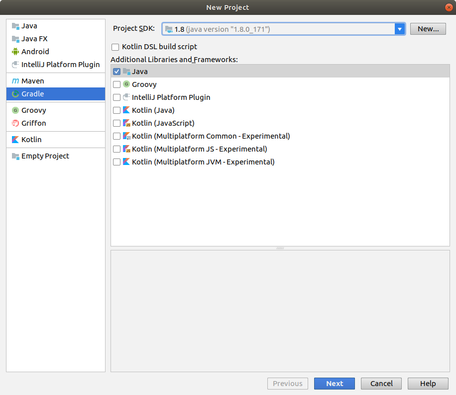
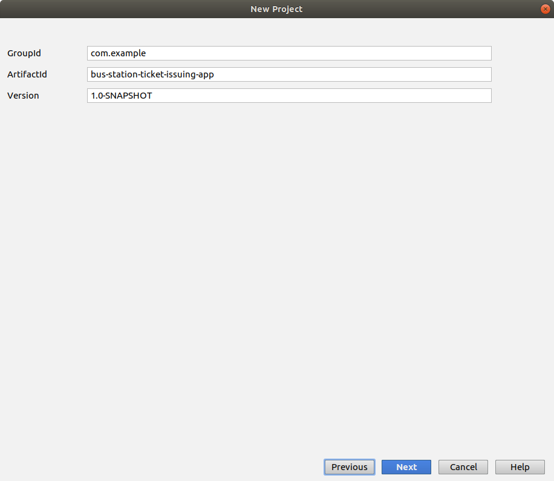
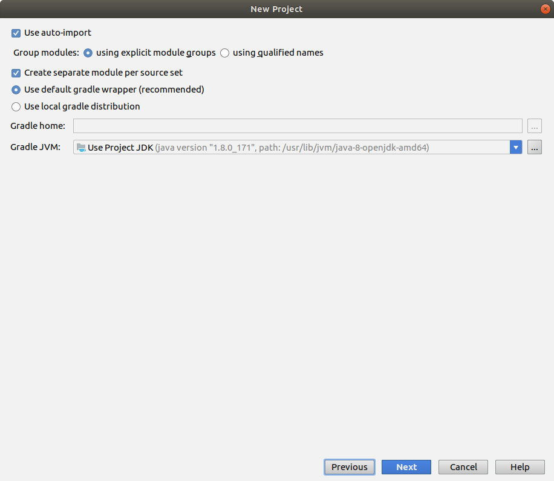
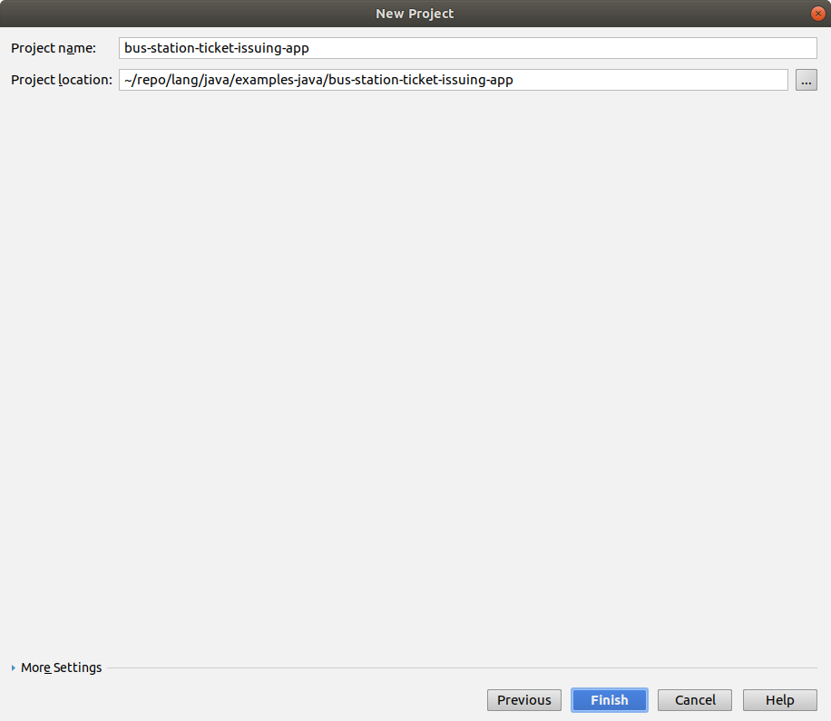

# Problem Statement

Разработать информационную систему, в данном случае это программа билетная касса автовокзала. 

Рекомендуется использовать динамические структуры, но если это целесообразно. 

Основная задача программы - формирование билетов, в которых должен быть указан:
- начальный и конечный пункт отправления и прибытия, 
- время отправления и прибытия, 
- номер маршрута 
- и стоимость билета. 

Должна быть возможность:
- добавления новых маршрутов, стоимости и времени и удаления, 
- ну и выбор из имеющихся для формирования билета.

Приложение с графическим интерфейсом. 

Также нужно описать структуру программы, классы и методы, что каждый из них описывает и блок-схема программы. 

# Screenshots

## Swing Application

<kbd></kbd>

<kbd></kbd>

<kbd></kbd>

<kbd></kbd>

## New Project

<kbd></kbd>

<kbd></kbd>

<kbd></kbd>

<kbd></kbd>

# Class Diagram

<kbd></kbd>

# Структурная схема

<kbd></kbd>

# Mockups

<kbd></kbd>

<kbd></kbd>

<kbd></kbd>

