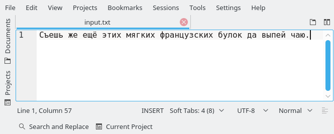
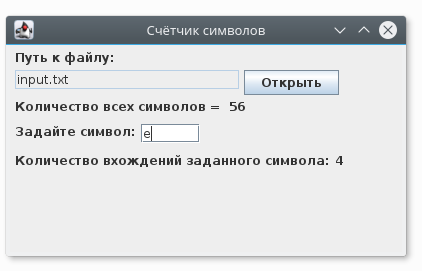

# Problem Statement

Разработать простейшее графическое приложение в Java для подсчета количества символов и количества вхождений заданного символа в текстовом файле.

# Screenshots

# Links

- [How to create an hello world in Java Swing? What is wrong in my code? - Stack Overflow](https://stackoverflow.com/a/18978404/2289640)
- [Как начать пользоваться Swing GUI-визардом IntelliJ IDEA. Подробная инструкция / Хабрахабр](https://habrahabr.ru/post/305974/)
- [Designing GUI. Major Steps - Help | IntelliJ IDEA](https://www.jetbrains.com/help/idea/designing-gui-major-steps.html)
- [Trail: Creating a GUI With JFC/Swing (The Java&trade; Tutorials)](https://docs.oracle.com/javase/tutorial/uiswing/)

- [A Visual Guide to Swing Components (from: The Java&trade; Tutorials &gt; Graphical User Interfaces &gt; Swing Features)](http://web.mit.edu/6.005/www/sp14/psets/ps4/java-6-tutorial/components.html)
- [Java Swing Tutorial - javatpoint](https://www.javatpoint.com/java-swing)
- [SWING - Controls](https://www.tutorialspoint.com/swing/swing_controls.htm)

- [JFrame pack() - Java Swing - Java Tutorial](http://hajsoftutorial.com/jframe-pack/)
- [java - What does .pack() do? - Stack Overflow](https://stackoverflow.com/a/22982334/2289640)

- [Менеджеры компоновки Layout в Swing](http://www.quizful.net/post/swing-layout-managers)
- [SWING - Layouts](https://www.tutorialspoint.com/swing/swing_layouts.htm)

- [Springs and Component Size : SpringLayout « Swing « Java Tutorial](http://www.java2s.com/Tutorial/Java/0240__Swing/SpringsandComponentSize.htm)
- [SWING - SpringLayout Class](https://www.tutorialspoint.com/swing/swing_springlayout.htm)

- [compiler construction - javac option to compile all java files under a given directory recursively - Stack Overflow](https://stackoverflow.com/a/29438033/2289640)
- [java - What is the $1 in class file names? - Stack Overflow](https://stackoverflow.com/a/1075217/2289640)
- [Java creating .jar file - Stack Overflow](https://stackoverflow.com/a/4597892/2289640)
- [Viewing the Contents of a JAR File (The Java&trade; Tutorials &gt; Deployment &gt; Packaging Programs in JAR Files)](https://docs.oracle.com/javase/tutorial/deployment/jar/view.html)
